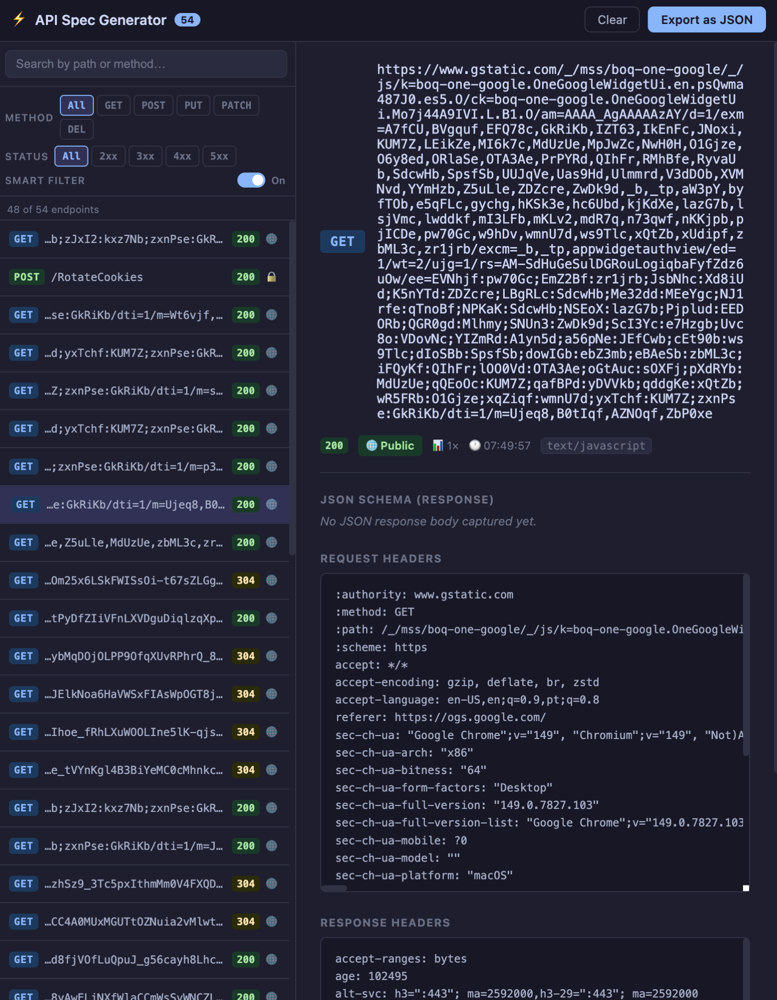

# API Spec Generator

> A mini study project built to explore how Chrome DevTools Extensions work — specifically the DevTools APIs, MV3 service worker lifecycle, port-based message passing, and runtime network interception.

This is **not** a production tool. It was built over a couple of sessions as a hands-on way to understand the internals of browser extension development.

---

## What it does

API Spec Generator is a Chrome DevTools panel that captures HTTP traffic from the inspected page in real time, infers JSON schemas from response bodies, and lets you export the result as an **OpenAPI 3.1** spec.



### Features

- **Real-time capture** — hooks into `chrome.devtools.network.onRequestFinished` and processes every request as it completes
- **Schema inference** — walks the JSON response body and infers types, formats (`uuid`, `date-time`, `uri`), and structure
- **Schema merging** — if the same endpoint is called multiple times, the schemas are merged so the final output is as complete as possible
- **Sensitive data redaction** — `Authorization`, `Cookie`, `X-API-Key`, and common body fields like `password` and `token` are replaced with `<REDACTED>` before storage
- **Smart filter** — hides JS bundles, HMR noise, HTML navigation, and other build artifacts with a single toggle
- **Method + status filters** — narrow the list by HTTP method (GET, POST, PUT, PATCH, DELETE) or response band (2xx, 3xx, 4xx, 5xx)
- **Export mode** — select individual endpoints via checkboxes and export only what you want as a `.json` file

---

## Installation

This extension is **not published to the Chrome Web Store**. Load it manually:

1. Clone or download this repository
2. Open Chrome and navigate to `chrome://extensions`
3. Enable **Developer mode** (top-right toggle)
4. Click **Load unpacked** and select the repository folder
5. Open any page, press **F12**, and select the **"API Spec"** tab

---

## How to use

### Capturing endpoints

1. Open DevTools on the page you want to document
2. Navigate to the **API Spec** panel
3. Interact with the page — log in, load data, submit forms
4. Endpoints appear in the left panel in real time

### Filtering

| Control | Effect |
|---|---|
| Search bar | Filter by path or method text |
| Method pills | Show only a specific HTTP method |
| Status pills | Show only a specific response band |
| Smart Filter toggle | Hide build noise (JS chunks, HMR, HTML) |

### Exporting

1. Click **Export as JSON** — the panel enters export mode (blue toolbar border)
2. Check the endpoints you want using the checkboxes on the right of each list item
3. Optionally click an endpoint to open its detail view and use the **Select** button there
4. Click **Export N selected** — downloads the OpenAPI 3.1 spec and exits export mode
5. Click **Cancel** to exit export mode without downloading

---

## Architecture

```
manifest.json       permissions, devtools_page, background SW
devtools.html       host page for the DevTools context (loads devtools.js)
devtools.js         network listener, schema inference, state management
background.js       message relay — routes ports between devtools.js and panel.js
panel.html          panel UI structure
panel.js            rendering, filter state machine, export mode
panel.css           dark theme (Catppuccin Mocha palette)
```

### Message flow

```
devtools.js  ──port('devtools')──▶  background.js  ──port('panel')──▶  panel.js
             ◀── STATE_UPDATE ───                   ◀── routed msg ──
```

DevTools pages don't expose a `tab.id` via `port.sender`, so every message from `devtools.js` carries `tabId: chrome.devtools.inspectedWindow.tabId`. The background uses that value to route to the correct panel instance.

Both `devtools.js` and `panel.js` reconnect automatically when the MV3 service worker is killed and restarted (which Chrome does after ~30 s of inactivity).