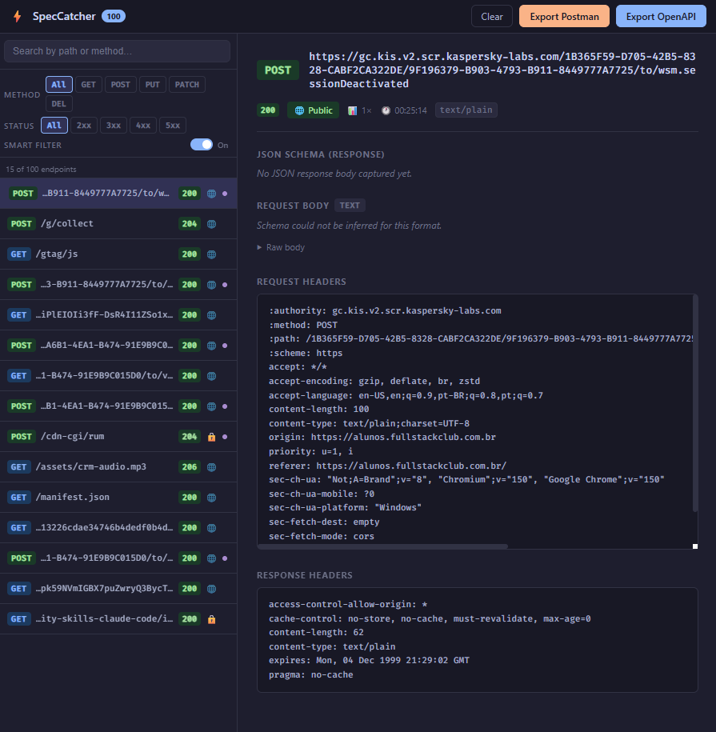

# SpecCatcher

> A Chrome DevTools extension that automatically captures HTTP traffic and generates comprehensive API documentation directly from your browser.

SpecCatcher hooks into your network traffic in real-time, analyzing the requests and responses made by the page. By inferring data structures on the fly, it builds detailed JSON schemas and allows you to easily export the documented endpoints into standard formats like **OpenAPI 3.1** and **Postman Collection v2.1**.

---

## 🚀 What it does

SpecCatcher provides a dedicated panel in Chrome DevTools that listens to the network. As you interact with a web application, it records the API endpoints being called, analyzes their payloads (both request and response bodies), and intelligently infers their structure and data types. 

### Key Features

- **Real-Time Capture**: Seamlessly intercepts network requests as they happen, documenting the API surface simply by browsing the application.
- **Smart Schema Inference**: Automatically analyzes JSON bodies to determine data types, formats (like `uuid`, `date-time`, or `uri`), and nested structures.
- **Intelligent Merging**: If an endpoint is called multiple times with different payloads, schemas are merged to create a complete and accurate representation of the API.
- **Privacy First (Data Redaction)**: Automatically redacts sensitive information such as `Authorization` headers, `Cookie`s, `X-API-Key`s, and common sensitive fields (like passwords or tokens) before processing.
- **Built-in JWT Decoder**: Automatically detects, decodes, and displays JWT payloads directly in the endpoint's detail view.
- **Noise Filtering**: Features a "Smart Filter" to quickly hide irrelevant traffic like JavaScript bundles, HMR polling, or HTML navigation. You can also filter by HTTP method or status code.
- **Versatile Exporting**: Select specific endpoints and export them as an **OpenAPI 3.1** specification or a ready-to-use **Postman Collection v2.1**.

---

## 🛠 Installation

This extension is currently intended for manual installation via Developer Mode:

1. Clone or download this repository.
2. Open Chrome and navigate to `chrome://extensions`.
3. Enable **Developer mode** (toggle in the top-right corner).
4. Click **Load unpacked** and select the repository folder.
5. Open any web page, press **F12** to open DevTools, and navigate to the **SpecCatcher** tab.

---

## 💡 How to use

1. **Start Capturing**: Open the DevTools panel and interact with your web application (log in, submit forms, fetch data). Endpoints will appear in the panel automatically.
2. **Explore Details**: Click on any captured endpoint to view its inferred request and response schemas, decoded JWTs, and headers.
3. **Filter the Noise**: Use the search bar, method/status pills, or the Smart Filter to focus only on the API calls you care about.
4. **Export**: 
   - Click the **Export Mode** button.
   - Select the endpoints you wish to document using the checkboxes.
   - Choose to export as either **OpenAPI** or **Postman**, and the generated `.json` file will be downloaded immediately.